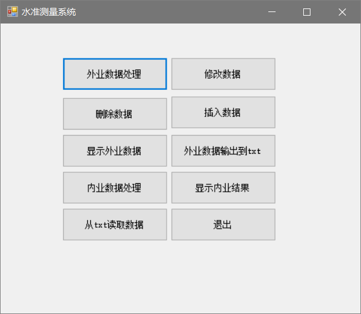
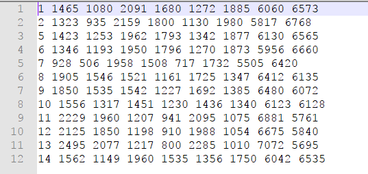

# Leveling
基于《数字地形测量学》写的C#调C++所写的dll的WinForm程序，主要练习C++，顺便练习下C#    
生成的dll文件需要放到和exe文件的同一位置，不然找不到路径。

## 主页

## 内业数据处理

根据提示输入，可以得到数据

## 读取txt
  
菜单中支持从txt文件中读取数据，读取的顺序为：  
1. 测站序号（这项数据是为了让输入者不会混淆，仅仅作为提示，就算错误也没关系，如图片中第三行“5”）
2. 后视尺：上丝， 
3. 后视尺：下丝,
4. 前视尺：上丝，
5. 前视尺：下丝，
6. 后视尺：黑面中丝，
7. 前视尺:黑面中丝，
8. 后视尺：红面中丝，
9. 前视尺：红面中丝  

**每一行即是一个测站数据**